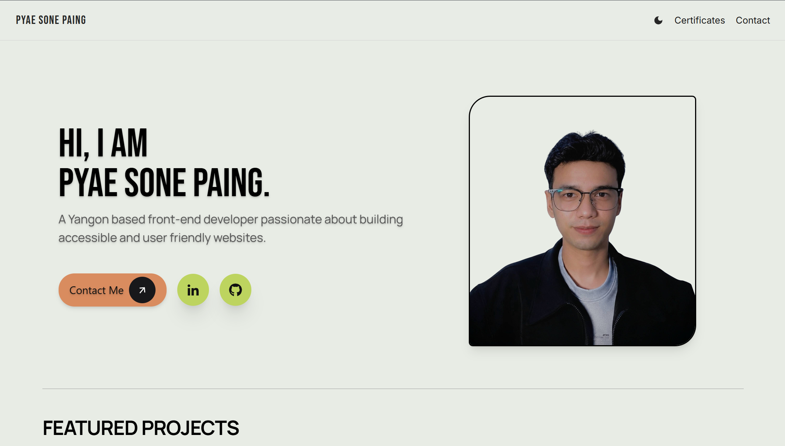

# Pyae Sone Paing Portfolio

A responsive personal portfolio website for **Pyae Sone Paing**, a Yangon-based front-end developer. The site highlights selected projects, professional certificates, technical skills, contact details, social profiles, and a downloadable resume.

## Preview



## Features

- Responsive layout for mobile, tablet, and desktop screens
- Light and dark mode
- Featured project cards with live-demo and GitHub links
- Certificates page with external certificate links
- Technology and skills overview
- Contact section, social-media links, and resume link
- Accessibility-focused UI, including:
  - Semantic headings, sections, articles, lists, and project details
  - Keyboard-visible focus styles
  - Accessible names for icon-only controls and social links
  - Descriptive alternative text for portfolio images
  - Screen-reader-friendly decorative icons
  - Reduced-motion support for hover animations

## Built With

- React
- TypeScript
- React Router
- Tailwind CSS
- React Icons
- `@dev.icons/react`

## Getting Started

### Prerequisites

Install a current LTS version of [Node.js](https://nodejs.org/).

### Installation

1. Clone the repository.

   ```bash
   git clone https://github.com/peterpaing/Portfolio.git
   ```

2. Open the project folder.

   ```bash
   cd Portfolio
   ```

3. Install dependencies.

   ```bash
   npm install
   ```

4. Start the development server.

   ```bash
   npm run dev
   ```

5. Open the local URL shown in your terminal, usually `http://localhost:5173`.

## Available Scripts

```bash
npm run dev      # Start the development server
npm run build    # Create a production build
npm run preview  # Preview the production build locally
```

## Project Structure

```text
src/
├── assets/           # Profile, certificate, and project images
├── components/       # Reusable page components
├── data/             # Portfolio project and certificate data
├── pages/            # Route-level pages
├── App.tsx
└── main.tsx

public/
└── Pyae_Sone_Paing_Junior_Frontend_Developer_Resume.pdf
```

## Accessibility

This project aims to follow practical WCAG 2.2 AA accessibility practices. It uses native HTML elements wherever possible, clear heading hierarchy, labelled interactive controls, keyboard focus indicators, and accessible external links.

If you add new content, make sure to:

- Provide meaningful `alt` text for informative images.
- Add an accessible label to icon-only links and buttons.
- Keep headings in order without skipping levels.
- Ensure new text and focus indicators have sufficient contrast.
- Test all interactions using only the keyboard.

## Contact

- Email: [pyaesonepaing104@gmail.com](mailto:pyaesonepaing104@gmail.com)
- GitHub: [github.com/peterpaing](https://github.com/peterpaing)
- LinkedIn: [Pyae Sone Paing](https://www.linkedin.com/in/pyae-sone-paing-06a283418/)

## License

This project is for personal portfolio use. All rights reserved.
